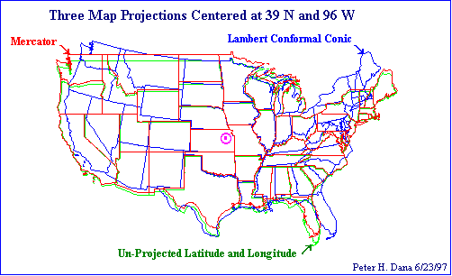

# Where Am I, Really?

## A Quick Intro to (Open Source) GIS

Enough concepts and Googleable terms to whet your appetite.

---

## Mapping

- one-to-one maps
- abstractions, applicability to purpose
- local references

2011 earthquake moved the Japan coast 2.4 meters (8 feet), some areas of sea bed as much as 50 meters laterally, and changed earth's axis of rotation.

---

## ESRI

Huge. Expensive. Unless you're a student in which case they're trying to hook you. Complex (but, then, GIS is complex).

---

## Basic GIS

- Automating map making.

Coordinate systems:

- Datum (Datums? Really?)
- Projections

---

## Datum: The earth is a...

<strike>sphere</strike>... uh ... <strike>ellipsoid</strike>... uh ... <strike>oblate spheroid</strike> ... <em>blob</em>

---

## Datum: The earth is ellipsoids

---

## Datum

- Lots of them
- NAD27 and NAD83
- WGS84

These are diverging over time... Latitude and Longitude don't uniquely identify a location.

---

## Projection

Mapping the ellipsoid to a plane. Even more of them.

- http://www.colorado.edu/geography/gcraft/notes/mapproj/mapproj_f.html
- http://xkcd.com/977/

---

## EPSG

- EPSG Geodetic Parameter Dataset
- EPSG:4326 - ESPG-speak for WGS84
- EPSG:900913 and EPSG:3857 - Google Maps
- EPSG:2226 - "NAD83 / California zone 2 (ftUS)" local GIS

---

### KML

http://www.flutterby.net/2009-05-18_walk_for_coffee

---

### KML

On Google Earth

---

### KML/KMZ

- Keyhole Markup Language XML
- KMZ is zipped XML + images/other resources
- Geometry, layers, line style, icons, etc
- Flythroughs & Tours (sound, temporary features, etc)

---

## Shapefiles

A ZIP file with a collection of a bunch of files inside it

<pre>$ unzip /blablabla/geo/sonomacounty/PAR_PARCELS.zip 
Archive:  /blablabla/sonomacounty/PAR_PARCELS.zip
  inflating: PAR_PARCELS.shx         
  inflating: PAR_PARCELS.dbf         
  inflating: PAR_PARCELS.prj         
  inflating: PAR_PARCELS.sbn         
  inflating: PAR_PARCELS.sbx         
  inflating: PAR_PARCELS.shp         
  inflating: PAR_PARCELS.shp.xml</pre>

---

### Others

- GeoJSON
- GeoRSS

---

### Spatial SQL

- PostGIS - PostgreSQL
- SpatiaLite - SQLite

(and those other also-rans: IBM DBII, Oracle Locator/Spatial, Microsoft SQL Server with spatial extensions, even MySQL)

--- 

### Spatial SQL

Open Geospatial Consortium (OGS):
http://www.opengeospatial.org/standards/sfs

(Also useful for Euclidean geometries.)

---

### Spatial SQL - Example

<code>(SELECT the_geom FROM par_parcels WHERE subdivisio ILIKE '%PETALUMA%') AS the_geom</code>

---

### Spatial SQL - Example

<code>SELECT DISTINCT(par_parcels.the_geom) FROM par_parcels , hyd_usgsstrm 
   WHERE ST_DWithin(par_parcels.the_geom, hyd_usgsstrm.the_geom, 1)</code>

---

### Spatial SQL - Example

<code>SELECT DISTINCT(par_parcels.the_geom) FROM par_parcels , hyd_usgsstrm 
   WHERE ST_DWithin(par_parcels.the_geom, hyd_usgsstrm.the_geom, 50)</code>

---

### JavaScript libraries

Use a tile server and have some vector capabilities.

- http://openlayers.org/ - kitchen sink, what I've used.
- http://leafletjs.com/ - focus on mobile
- http://kartograph.org/
- http://polymaps.org/

---

### Mapnik

Tile/image generator. C++ and Python bindings, XML interface language.

---

### GDAL

Geospatial Data Abstraction Library

- OGR format conversion utility tools
- bindings for most languages

---

### Geoserver

Java based tile generator kitchen sink.

---

### QGIS

Desktop GIS system. Plugins for everything from trainable image classification to flooding & hydraulics simulation.

---

## Resources

- North Bay GIS User Group http://northbaygis.org/
- Sonoma County GIS http://sonomacounty.ca.gov/ISD/Systems-and-Programming/GIS/Data-Downloads/ and Permit and Resource Management Department http://www.sonoma-county.org/prmd/gisdata/data_download.htm
- US Census TIGER Data https://www.census.gov/geo/maps-data/data/tiger.html
- National Map http://nationalmap.gov/
- Open Street Map http://www.openstreetmap.org/
